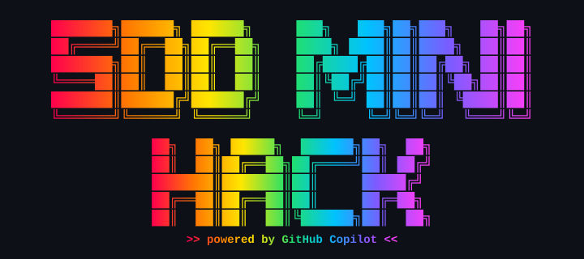

<h1 align="center">SDD Mini Hack with GitHub Copilot</h1>

<p align="center">
  
</p>

> Learn spec-driven development and agentic engineering in one focused hour.

Pick **one** of the seven scenarios below, watch the short video, and follow the matching scenario doc.

| # | Scenario | Tooling | Guide |
|---|---|---|---|
| 1 | Greenfield Todo App | OpenSpec + Copilot Chat | [docs/scenario-1-openspec-todo.md](docs/scenario-1-openspec-todo.md) |
| 2 | Brownfield Feature | Copilot Plan Mode | [docs/scenario-2-plan-mode-bookshelf.md](docs/scenario-2-plan-mode-bookshelf.md) |
| 3 | Legacy Modernization | Spec Kit | [docs/scenario-3-speckit-cobol.md](docs/scenario-3-speckit-cobol.md) |
| 4 | Personal Assistant | Copilot CLI + Squad + OpenSpec | [docs/scenario-4-cli-squad-assistant.md](docs/scenario-4-cli-squad-assistant.md) |
| 5 | ETL Pipeline (data) | Copilot CLI + Squad + Spec Kit | [docs/scenario-5-speckit-etl-pipeline.md](docs/scenario-5-speckit-etl-pipeline.md) |
| 6 | Angular → React Modernization | Copilot CLI + Squad + Spec Kit + Playwright | [docs/scenario-6-speckit-angular-react.md](docs/scenario-6-speckit-angular-react.md) |
| 7 | Shareable Balloon Message | Copilot CLI/Desktop + GitHub Issues + Wayfinder | [docs/scenario-7-copilot-app-balloon.md](docs/scenario-7-copilot-app-balloon.md) |

Each scenario has an `examples/scenario-N-…/` folder — the location you run it from. Some come with starter files; others contain only a README and are populated as you go.

## Common prerequisites (all scenarios)

- **VS Code** with **GitHub Copilot** + **Copilot Chat** signed in.
- **Node.js 20.19+** (`node --version`).
- **Playwright MCP** is preconfigured for VS Code (`.vscode/mcp.json`) and Copilot CLI (`.mcp.json`). It runs on demand via `npx @playwright/mcp@latest`. You can also use **Playwright CLI** as a backup (`npm install -g playwright && npx playwright install chromium`).

For a complete scenario-by-scenario prerequisites matrix (including hackathon-only extras), see [docs/prerequisites.md](docs/prerequisites.md).

```bash
git clone https://github.com/pascalvanderheiden/sdd-mini-hack.git
cd sdd-mini-hack
code .
```

---

## Scenario 1 — Greenfield Todo App with OpenSpec

Build a small todo app from a spec. Validate it with the Playwright MCP server.

**Extra prereqs**

- OpenSpec: `npm install -g @fission-ai/openspec@latest`
- VS Code extension: [OpenSpec for Copilot](https://marketplace.visualstudio.com/items?itemName=atman-dev.openspec-for-copilot) (`atman-dev.openspec-for-copilot`)

**Demo video**

https://github.com/user-attachments/assets/5faa2be8-b3c0-4fdc-a3bc-67c08038b732

<!-- Fallback for VS Code markdown preview (GitHub renders the link above as a player). -->
<video src="media/videos/scenario-1-openspec-greenfield.mp4" controls width="720"></video>

→ Follow [docs/scenario-1-openspec-todo.md](docs/scenario-1-openspec-todo.md)

---

## Scenario 2 — Brownfield Feature with Copilot Plan Mode

Add a feature to the included **Bookshelf** app, then validate it through Playwright MCP.

**Extra prereqs**

- The sample app under `examples/scenario-2-bookshelf-app` (already in the repo, no install).

**Demo video**

https://github.com/user-attachments/assets/3fe9613e-e51a-4692-af87-ffe3dd931c8f

<!-- Fallback for VS Code markdown preview (GitHub renders the link above as a player). -->
<video src="media/videos/scenario-2-plan-mode.mp4" controls width="720"></video>

→ Follow [docs/scenario-2-plan-mode-bookshelf.md](docs/scenario-2-plan-mode-bookshelf.md)

---

## Scenario 3 — Legacy Modernization with Spec Kit (COBOL → Modern Stack)

Clone a legacy **COBOL accounting system** as the source, then use Spec Kit to specify, plan, task, and implement a modern rewrite.

**Extra prereqs**

- **GnuCOBOL** to run the legacy app:
  - macOS: `brew install gnu-cobol`
  - Linux: `sudo apt-get install -y gnucobol`
  - Windows: install via [GnuCOBOL Windows builds](https://gnucobol.sourceforge.io/) or use WSL.
- **Python 3.12+** and **uv**: `curl -LsSf https://astral.sh/uv/install.sh | sh`
- **Spec Kit**: `uv tool install specify-cli --from git+https://github.com/github/spec-kit.git`
- VS Code extension: [SpecKit Companion](https://marketplace.visualstudio.com/items?itemName=alfredoperez.speckit-companion) (`alfredoperez.speckit-companion`)

**Demo video**

https://github.com/user-attachments/assets/21c5ae57-3ed1-4a28-84f5-ea962bc19ae4

<!-- Fallback for VS Code markdown preview (GitHub renders the link above as a player). -->
<video src="media/videos/scenario-3-speckit-legacy-modernization.mp4" controls width="720"></video>

→ Follow [docs/scenario-3-speckit-cobol.md](docs/scenario-3-speckit-cobol.md)

---

## Scenario 4 — Personal Assistant with Squad + OpenSpec via Copilot CLI

Use **Copilot CLI** with the **Squad** agent. Add a Squad team member that owns OpenSpec, then have them propose and execute a personal assistant app.

**Extra prereqs**

- GitHub Copilot CLI signed in (`copilot --help`).
- Squad: `npm install -g @bradygaster/squad-cli` (`squad doctor`).
- OpenSpec: `npm install -g @fission-ai/openspec@latest`.

**Demo video**

https://github.com/user-attachments/assets/7b923c1d-a235-41e8-bcfd-54e54f6705de

<!-- Fallback for VS Code markdown preview (GitHub renders the link above as a player). -->
<video src="media/videos/scenario-4-squad-cli.mp4" controls width="720"></video>

→ Follow [docs/scenario-4-cli-squad-assistant.md](docs/scenario-4-cli-squad-assistant.md)

---

## Scenario 5 — Greenfield ETL Pipeline with Squad + Spec Kit

Execute the **complete Spec Kit lifecycle** orchestrated by the **Squad** team, landing two public climate datasets into a local PostgreSQL container.

**Extra prereqs**

- Docker with docker compose (`docker --version`).
- Python 3.12+ and uv: `curl -LsSf https://astral.sh/uv/install.sh | sh`
- Spec Kit: `uv tool install specify-cli --from git+https://github.com/github/spec-kit.git`
- GitHub Copilot CLI signed in (`copilot --help`).
- Squad: `npm install -g @bradygaster/squad-cli` (`squad doctor`).
- psql client (optional): `brew install postgresql@16` (macOS) or `sudo apt-get install postgresql-client` (Linux).

**Demo video**

https://github.com/user-attachments/assets/4317ecf4-5cca-4eb1-afa8-a43480293643

<!-- Fallback for VS Code markdown preview (GitHub renders the link above as a player). -->
<video src="media/videos/scenario-5-cli-etl-pipeline.mp4" controls width="720"></video>

→ Follow [docs/scenario-5-speckit-etl-pipeline.md](docs/scenario-5-speckit-etl-pipeline.md)

---

## Scenario 6 — Angular → React Modernization with Squad + Spec Kit

Use **Copilot CLI** with the **Squad** agent to run the full **Spec Kit** lifecycle and modernize the **Angular RealWorld** app's frontend to **React** — same UI, frontend only — then validate it with **Playwright**.

**Extra prereqs**

- GitHub Copilot CLI signed in (`copilot --help`).
- Squad: `npm install -g @bradygaster/squad-cli` (`squad doctor`).
- Spec Kit: `uv tool install specify-cli --from git+https://github.com/github/spec-kit.git`.
- Node.js 20.19+ and Playwright (MCP preconfigured; CLI backup `npm install -g playwright && npx playwright install chromium`).

**Demo video**

https://github.com/user-attachments/assets/3b11f5a8-1d03-4a7d-8bc4-36196ca4f930

<!-- Fallback for VS Code markdown preview (GitHub renders the link above as a player). -->
<video src="media/videos/scenario-6-angular-react.mp4" controls width="720"></video>

→ Follow [docs/scenario-6-speckit-angular-react.md](docs/scenario-6-speckit-angular-react.md)

---

## Scenario 7 — Shareable Balloon Message with Copilot and Wayfinder SDD

Use **GitHub Copilot CLI or the GitHub Copilot Desktop App**, **GitHub Issues**, and Matt Pocock's Wayfinder process to turn a playful Balloon idea into a specification, implementation ticket, working app, and reviewed change.

**Extra prereqs**

- GitHub Issues are recommended for the workshop flow; Matt Pocock's skills can also use local files or GitLab.
- Fork this repository, or create and push a dedicated Scenario 7 repository with the GitHub CLI.
- GitHub Copilot CLI, or the [GitHub Copilot Desktop App](https://github.com/features/ai/github-app) for [macOS](https://gh.io/copilot-app-mac) or [Windows](https://gh.io/copilot-app-win64).
- Matt Pocock's skills installed with `npx skills@latest add mattpocock/skills`.
- Node.js 20.19+ and Playwright (MCP preconfigured; CLI backup `npm install -g playwright && npx playwright install chromium`).

**Demo video**

https://www.youtube.com/watch?v=F3lL98Pj90o&t=3s

<!-- Fallback for VS Code markdown preview (GitHub renders the link above as a player). -->
https://github.com/user-attachments/assets/1ecdf27f-d356-4fb7-9e03-e4715e4af12c

→ Follow [docs/scenario-7-copilot-app-balloon.md](docs/scenario-7-copilot-app-balloon.md)

---

Two small skills are included under `.github/skills/`. Copilot can use them when relevant; you do not have to invoke them manually.

- [`frontend-design`](.github/skills/frontend-design/SKILL.md) — opinionated UI defaults for scenarios 1, 2, 4, and 7.
- [`legacy-cobol-explorer`](.github/skills/legacy-cobol-explorer/SKILL.md) — domain notes for the COBOL sample in scenario 3.

## Verify your setup

```bash
./scripts/verify-workshop.sh
```

## Project structure

```text
.
├── .devcontainer/        # Codespaces config
├── .github/skills/       # Optional Copilot skills
├── .vscode/              # Editor + MCP config (Playwright)
├── .mcp.json             # MCP config for Copilot CLI
├── docs/                 # 7 scenario guides (one per scenario)
├── examples/
│   ├── scenario-1-openspec-todo/        # Scenario 1 (greenfield, from scratch)
│   ├── scenario-2-bookshelf-app/        # Scenario 2 starter
│   ├── scenario-3-legacy-cobol-library/ # Scenario 3 (clone COBOL source here)
│   ├── scenario-4-cli-squad-assistant/  # Scenario 4 (greenfield, from scratch)
│   ├── scenario-5-etl-climate-pipeline/ # Scenario 5 starter (PostgreSQL ETL)
│   ├── scenario-6-angular-realworld-react/ # Scenario 6 working folder (Angular→React)
│   └── scenario-7-balloon-message/         # Scenario 7 greenfield working folder
├── media/videos/         # demo videos
└── scripts/              # Verification helper
```

---

## Bonus (optional, not required for this lab)

Want to design your own reusable agentic template? See [docs/meta-agentic-template.md](docs/meta-agentic-template.md) for a simple meta-cognition flow covering prompts, skills, agents, and MCP servers.

It works really well to combine your agentic template with spec-driven development: once the template knows *how to work*, layer SDD on top so the agent also *works from a spec* — making your solutions more sophisticated and reviewable.
