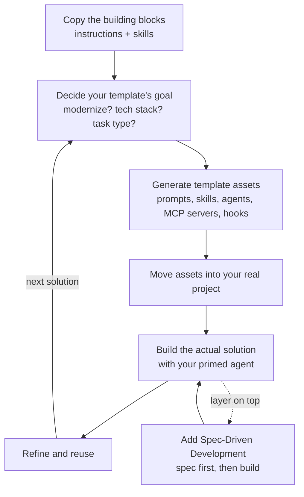

# Meta-Cognition Guide: Build Your Own Agentic Template

This guide shows a simple, repeatable way to build your **own** agentic template — a reusable set of instructions, skills, prompts, and agents that an AI coding agent uses to generate the solution you want.

The idea is "meta-cognition": instead of asking the agent to build your app directly, you first teach the agent *how to think and work* on your kind of project. Then you point that primed agent at the real project.

## The process at a glance



Each box maps to a step in the [Step-by-step](#step-by-step) section below.

## What's already in this project

You don't need to download anything. The meta-cognition building blocks are already included here, sourced from [Awesome Copilot](https://github.com/github/awesome-copilot) and the Anthropic skills collection.

### Instruction files — `.github/instructions/`

These set the quality bar and tell the agent *how* to build each type of asset. Each file uses an `applyTo` glob so it only kicks in for the matching files:

- [`instructions.instructions.md`](../.github/instructions/instructions.instructions.md) — how to write **custom instruction files** themselves (applies to `**/*.instructions.md`). The "meta" rulebook for all the others.
- [`prompt.instructions.md`](../.github/instructions/prompt.instructions.md) — how to write high-quality **prompt files** (`**/*.prompt.md`).
- [`agent-skills.instructions.md`](../.github/instructions/agent-skills.instructions.md) — how to write high-quality **skills** (`**/skills/**/SKILL.md`).
- [`agents.instructions.md`](../.github/instructions/agents.instructions.md) — how to write **custom agent files** (`**/*.agent.md`).
- [`hooks.instructions.md`](../.github/instructions/hooks.instructions.md) — how to author safe, fast, deterministic **lifecycle hooks** (`.github/hooks/**`, `hooks/**`).
- [`caveman-mode.instructions.md`](../.github/instructions/caveman-mode.instructions.md) — an example **behavior toggle**: terse, low-token responses (applies to `**`). Shows how an instruction file can reshape the agent's style on demand.

### Skills — `.github/skills/`

Two ready-to-use skills, also from Awesome Copilot:

- [`skill-creator`](../.github/skills/skill-creator/SKILL.md) — a skill that helps you **create new skills**.
- [`mcp-builder`](../.github/skills/mcp-builder/SKILL.md) — a skill that helps you **build MCP servers** (tools the agent can call).

Together these are your "factory": instruction files set the quality bar, and the two skills help you produce the prompts, skills, agents, and MCP servers your template needs.

## The simple idea

1. **Copy** the instruction files and skills above into a new, empty project.
2. **Decide** what kind of agentic template you want (see Step 2).
3. **Generate** the prompts, skills, agents, and MCP servers for that goal — using the copied skills.
4. **Move** everything into the project where you'll build the real solution.
5. **Build** the actual solution with your primed agent.

That's it. The rest of this guide is just those five steps in detail.

## Step-by-step

### Step 1 — Copy the building blocks

Create a new project folder and copy these into it:

```text
.github/instructions/   # prompt, agent-skills, agents instruction files
.github/skills/         # skill-creator and mcp-builder
```

This is your meta-template starting point.

### Step 2 — Decide what your template is for

Write one or two sentences describing the kind of work you want the template to be good at. Examples:

- "Modernize legacy COBOL apps into a documented .NET service."
- "Scaffold new React + TypeScript web apps with tests."
- "Build Python data pipelines with infrastructure-as-code."

Be concrete about the tech stack, the type of task (greenfield, brownfield, modernization), and the outputs you expect (app, docs, tests, infra). Everything you generate next optimizes for this goal.

### Step 3 — Generate your template assets

Now use the copied skills and instructions to create the assets your goal needs:

- **Skills** — ask the agent to use `skill-creator` to build a skill for each repeatable workflow (e.g. "scaffold a React component", "write migration notes"). Guided by `agent-skills.instructions.md`.
- **MCP servers** — ask the agent to use `mcp-builder` if your goal needs custom tools (e.g. a database client, an internal API).
- **Prompts** — follow `prompt.instructions.md` to write reusable prompts for planning, coding, review, and debugging.
- **Agents** — follow `agents.instructions.md` to define specialized agent personas and their responsibilities.
- **Hooks** — follow `hooks.instructions.md` to add lifecycle hooks (e.g. run a linter or guard before a commit).
- **More instructions** — follow `instructions.instructions.md` to write your own instruction files (coding standards, behavior toggles like `caveman-mode`) that fit your goal.

Tip: start small. One skill, one prompt, maybe one MCP server. You can grow the template later.

### Step 4 — Move the assets into your real project

Once you're happy with the generated skills, instructions, prompts, and agents, copy them into the project where you'll build the actual solution. Then check that:

- prompts and instructions load correctly,
- skills trigger on the phrases you expect,
- any MCP tools are reachable.

Your agent is now primed for *your* kind of work.

### Step 5 — Build the solution

Point the primed agent at the real task. Because it already knows how to plan, which skills to trigger, and which tools to use, it produces better results with less hand-holding. Refine the template whenever something breaks, then reuse it on the next project.

## Combine with Spec-Driven Development

This pairs really well with **spec-driven development (SDD)** — the methodology used throughout this hack.

After you've built your agentic template with the meta-cognition skills, layer SDD on top inside that template: add an SDD workflow (for example using OpenSpec or Spec Kit, as shown in the [scenarios](../README.md)) so the agent first writes a clear spec, then implements against it.

The result is a template that not only knows *how to work* (meta-cognition) but also *works from a spec* (SDD) — making your agentic solutions far more sophisticated, predictable, and reviewable.

## Outcome

Follow this process and your agentic template becomes:

- **Composable** — prompts + skills + tools you can mix and match.
- **Repeatable** — the same flow scaffolds new solutions.
- **Sophisticated** — combine it with SDD for spec-first builds.

Use this file as your meta-cognition playbook whenever you start a new agentic solution.
